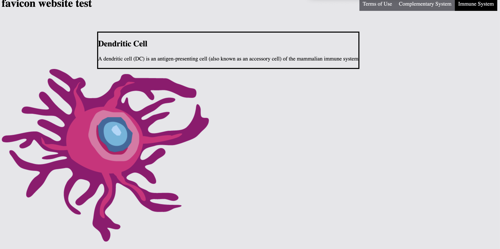
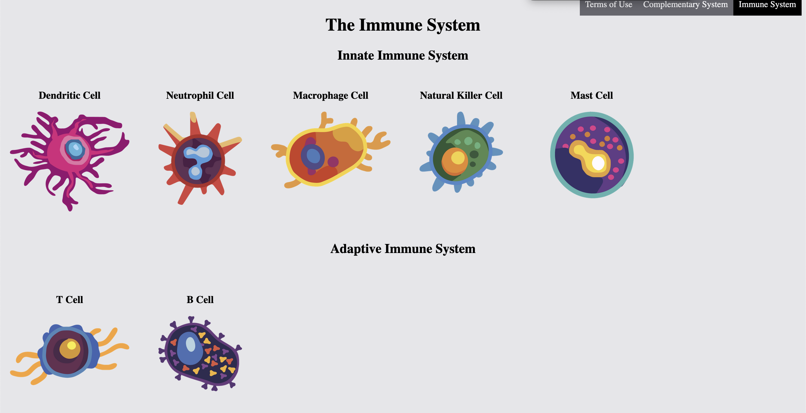
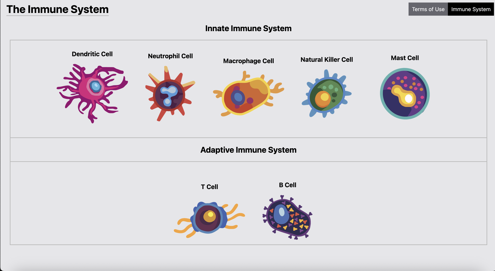

# 10CT2 Task 1 UX Design - Project Documentation

The website is hosted on github pages: [site](https://identity-fraud.github.io/10CT2-Task-1/)
## Project Proposal
### Design Brief

The book I have chosen for my UI/UX project is 'Immune' by Kurzgesagt. I plan to make an interactive website experience based around the book, targeting Kurzgesagt fans and biology interested people.

### Book Choice & Justification

'Immune' by Kurzgesagt (the popular YouTube science channel) is an informative biology hardcover that discusses how the immune system changes our body, using captivating illustrations and story telling. I chose this book because I have always loved the Kurzgesagt channel and their video series about the immune system convinced me to buy their corresponding book, so this would be a good opportunity to create an interactive site about it.

### User Experience Type

As mentioned before, I am making an interactive website for my project. This format should enhance the story and themes shown in the book as the interactive nature makes conveying information much more engaging for users, combined with Kurzgesagt's methodology of simplified story telling greatly enhances the complex themes that they present.

### Target Market

The target audience are people who are interested in biology, and the target age is around 12+ due to the reading comprehension required. Because this project is educational while being engaging it would appeal to many of the targeted audience and other people wanting to learn about the immune system in general. The website should remain very similar in terms of design and information presented to the book and the Kurzgesagt channel in general, using a similar art style and simplified story telling ensuring that it caters to the target audience.

### Software & Tools

I plan to use HTML and CSS to create my site, hosted through Github Pages; HTML and CSS allows me to fully customise my site without limitations unlike other website designers such as Figma, and Github Pages integrates this with Git allowing me to use Github Desktop for full version control and uploads changes to my repository which is required for the assessment task.

### Initial Brainstorming
#### Mindmap: 

#### Website

The feasibility of web development for me is possible as I already have a basic understanding of UI/UX design from those Adobe XD tutorials, and wireframes we drew at the beginning of the term. The effectiveness of having a website would allow far more potential in customisability for user interactions rather than using a website designer such as Figma.

#### Art style

The art style of Kurzgesagt is primarily a flat vector design, which makes it easier for me to trace and add on details using software like Adobe Illustrator. This makes it rather feasible for me to make images and UI elements using their style and will be effective in engaging the target audience due to having a similar style to Kurzgesagt.

## Functional Requirements
### Purpose

The website will allow users to explore how the immune system works and how it changes our bodies by allowing users the ability to view and interact with different parts of the immune system. Primarily the site is designed to engage Kurzgesagt fans, though some people may still buy the book because they liked the website.

### Use Cases & Test Cases

* User can select different immune cells images from the immune system on the screen, for an overview of facts about it quoted from the book
  * After clicking the cell they can select another button to fully zoom into the cell where different parts inside can be selected for more overview
* The user can switch between the different immune systems (complement) from a toggle button on the corner
   * Next to the toggleable button also is a dropdown down arrow button allowing only specific cells to be chosen, with images next to them
* Part of the navigation bar at the top has a button to switch to the antibody section, and another for pathogens or viruses
  * These switch to different backgrounds and cells having the ability to click on cells or viruses to analyse like before
* Cells can be moved around anywhere by dragging the images with a mouse
  * Specific interactions happens when moving certain cells to others (like immune cells to pathogens)

## Non-Functional Requirements
### Performance

The website will be designed to load within 5 seconds, all animations should be smooth and not stutter or take longer than a second to start.

### Usability

The layout will be planned to be consistent, specifically the top navigation bars and universal buttons. This ensures that people will not need to memorise where certains buttons are to navigate around the site. The font will also be at least size 12 ensuring readability and an option to select the 'dyslexic' font within the settings.

### Reliability

I will test the website primarily between a laptop and a monitor to ensure that different screen sizes still work. Though I will not be testing the site for phones or tablets I will make sure that compatibility across macOS and Windows is possible or Safari and Chrome and also ensure that there are no major bugs.

### Security

No data from the user will be collected or shared to any server by the website. I will also try my best to prevent the site from being backdoored or hacked.

## Social, Ethical and Legal Issues
### Social Impact
The main people who will use this website are Kurzgesagt fans and users interested in learning biology and the immune system. To ensure that the website is accessible and understandable by making the interface intuitive and the information easy to understand, the same way Kurzgesagt does. The site will also have some considerations into other operating systems, screen resolution and text font to accommodate for most users.

Because the website is designed to be informative, it will have many positive impacts of teaching people how the immune system works. Though there are certain potential risks such as incorrect information or it becomes 'too' simplified, missing key details. Outside of this there shouldn't be any groups or minorities excluded (except for the people that can't read english) or any sensitive information.

### Ethical Responsibilities

The only data the prototype will be 'collecting' will be user feedback, this will only be used to improve the website and the final design and will remain anonymous on who made it.

The themes and ideas, all information about them will be made to be as accurate about them as possible, while keeping it easy to understand. All immune cells and other pathogens will be attempted to be fairly represented, either through the design or the information told next to it.

The website aims to contain no discrimination about any cells, immune or pathogen, and also humans as well. Though it may be violent because the immune cells prefer to kill the pathogens and the pathogens prefer to kill the body cells. The prototypes will handle these responsibly by adding a violence warning screen before the website shows anything.

### Legal Considerations
I am intending this project for non-profit educational purposes allowing this project to be under fair use (or "dealings"). Though because my illustrations are heavily inspired by the other images and style of Kurzgesagt I will note this consideration within the terms of use. 

### Terms of Use
I will create a "Terms of Use" page within my website, crediting Kurzgesagt as the source of the information and inspiration for the images and stating as well that no data will be saved or sent anywhere by the website, apart from the website data itself. The "Terms of Use" page will be linked within the page footer and possibly on the navigation bar at the top as well. Though because I will be using the MIT License anyone will be able to copy and distribute it, as to stay consistent to the Github and open source software nature.

## Researching and Planning
### Gantt Chart

### UI PMI table

### Software PMI table

### Wireframes

### Wireframes Feedback

#### Feedback evaluation

I was going to implement Wireframes 2 though the implementation I wanted was too hard to create in javascript and I had already made my gallery type layout shown in Wireframes 1. To make my images more seperate to each other I have decided to create borders with a blur when they zoom in which might be difficult. I also chose to use titles within the cell description along with a different font size for important titles.

## Producing and Implementing
### Sprint 1
[prototype-1](prototypes/prototypes-1/prototype-1.html)

I started with a simple HTML boilerplate after having my Github pages setup correctly, then created my top navigation bar for future use where I add the terms of use and complement system pages. I then drew my example dendritic cell and added it here with a javascript to make it display text when I click it. I planned to add more images and fix the CSS to appear better.

I did certain testing to understand whether or not this basic html would be compatible between certain platforms, browsers and window resolutions (Windows, macOS and Chrome, Safari, Firefox and laptop, desktop). After my testing showed that all the javascript, html and CSS displays correctly across these different environments I decided to move on to the next sprint

Currently this prototype is very unfinished, and I hope make it more useable by adding more images and more information to the site. I am also considering to add an easier way to identify whether or not the image is a button by enlarging the image when hovering. 

#### Prototype Feedback (from peers)
  
"This cell image is way too large for some reason and the text has borders too close to the text. the image is very interesting though. also the description thing does not toggle and there is not a lot of information in it to justify taking that much space. You should also rename your website title to something other than test."

"very cool website but what is the purpose of this, and your image button thing is broken as well as your complementary system being completely empty for some reason. its also reallyu hard to realise that the image is clickable."

Overall many people critiqued my website on my broken javascript toggle which probably because I stole it from W3SketchSchools and that I should rename my website title. They also mentioned how it was easy to navigate between the different pages but very hard to notice that the image was even toggleable. Many testers also allowed me to recognise how accessible the website is from people accessing it from Firefix, Edge and Chrome. People also said that my top navigation bar was very intuitive and response, though they say otherwise about the image. The most critical area for improvement is clearly the image as I realised now with user feedback, and I should solve this in my next sprint by deleting the javascript and procrastinating making the information toggle.

### Sprint 2

[prototype-2](prototypes/prototypes-2/prototype-2.html)

I decided to add much more images and changed the CSS so that it appears in a grid layout. I then improved on the Terms of Use to include the license and actual terms. I also improved on the javascript to allow toggling the text. I also replaced the test favicon image with the neutrophil. At this state it is not interactable which I would add later.

Again I did testing to ensure it is compatible on all environments and found no issue except for where my first zooming in function feature breaks or appears in an incorrect position in different screen resolutions, which I fixed by completely removing it. 

At this stage my prototype is decently there though I believe I would not be able to finish certain UIs or elements in times such as the complement system and dropdown menus. I also plan to fix the zoom functions and hover functions.

#### Prototype Feedback

"this website is trash what is the point of this" 

"there is too much space on the right so you should add more adaptive immune cells."

"your website should have like lines to divide the sections, and make it more usable by adding information when you click the images or something. 

Clearly the removal of javascript made the website appear less informational and while this is only my second sprint I realised I need to focus and creating one instead of pushing it for later. I also decided in my next sprint I am adding border lines and seperator lines between the adaptive and innate immune systems as suggested and probably center the images as well to stop people complaining about the waste of space on the right.

### Sprint 3 (current site)

[prototype-3](site/index.html)

This is my final prototype and making the CSS and overall UI much more appealing. I started by changing the title from the middle to the left mirroring normal websites, then added borders and section breaks to further seperate the innate and adaptive immune system. I also added hover effects and made the zoom effect centered using CSS. I also added informative text that appears when you zoom (click) the images. I also added preloading to the backend which allows you to switch very quickly to other pages if you wanted. I again improved on the Terms of Use by making the title more consistent with the other pages. 

I tested on the same environments again and found no issues as well. 

I also decided to stop working on the other pages as I am running out of time to finish them, so many features I mentioned in this document will probably not be available on the site (apart from the image gallery, information and Terms of Use). 
## Ongoing Evaluation

The image here is the earliest I found because I sort of forgot to screenshot these (it is also the same as prototype 1) but the work I did in first week was work on the documentation and outline my project proposal and design briefs, I also did have a basic boilerplate but no UI elements apart from the title (favicon website test).

I first started with a simple top navigation bar which was a little difficult to make in the beginning because I had no understanding of CSS or HTML but after looking at W3SKetchSchools step by step tutorial I figured it out and built my own. I also drew my first image of the dendritic cell and later an attempt to create a javascript function to toggle a description which failed and I gave up on. 

This is also from my second prototype but since I never took any weekly screenshots this image is inaccurate but I did test many different ways to implement the javascript function to toggle the description before giving up. I would only later add the images and in general I did not get much done apart from make Terms of Use which is empty. I also changed the website background colour to a less bright white for easier viewing.

On this week I decided to add significantly more images and finally correct the layout using the CSS grid layout. I also completely removed the javascript function since it was too difficult and time consuming. I also added nonplaceholder titles and sub titles such as adaptive/innate immune system and I also changed the placeholder favicon with my new neutrophil image.

I improved on my website on the fifth week by finally adding the javascript function to toggle the description and even zoom in the image. Though currently the description only has placeholder text and I also added information to the Terms of Use like my license and the link to my repository. I also deleted the blank complement system page since I realised that I would probably not have enough time to fully make it.

This week I changed the font and added borders due to complaints whilst fixing the zoom function since the blur filter never applied to borders. I also replaced the placeholder description text with information I knew from the book itself and I decided to add some more information to the Terms of Use such as the fair dealings copyright exception.

## Final Evaluation

My product effectively met the basic functional and non-functional requirements such as displaying images of immune cells with related information to it also shown while zooming in with usable performance and compatbility though I did not meet some others. Use cases and functional requirements such as the complement system or the ability to drag other images did not end up in the final product for being too difficult and time consuming in this current scope. The current product is in my opinion very useable and reliable with intuitive UI/UX design for the purpose of this task. The final product does meet many of the intentions outlined in the design brief, which is that I successfully made an interactive website experience based off from the Kurzgesagt's Immune, and remains still relevant to the target audience. I think my project addresses relevant social, ethical, legal responsibilities correctly and effectively as I made sure it would very accessible to english speaking users and very relevant to the book while being under fair dealings. I believe I managed my time effectively though technically if I did not go to the TASmania trip I would likely have been able to finish or start the other pages such as complement and other features that I planned in the functional requirements. I think I had little challenges overall apart from learning HTML/CSS/JS from the start though I probably should've done weekly screenshots and reports but I kind of forgot about it. I think I effectively gathered and reponded to user feedback as many design choices in this site would not have existed without people complaining about certain small details such as borders and even the font. I think there are many improvements I could've done to my website, primarily I wished I could've added a gallery slideshow feature to display even more cell variants (e.g Killer T Cell) in the way Kurzgesagt has illustrated them, along with tailored information about them. Apart from those I am pretty find with this project as the other pages I thought in the functional requirements were pretty unnecessary.
